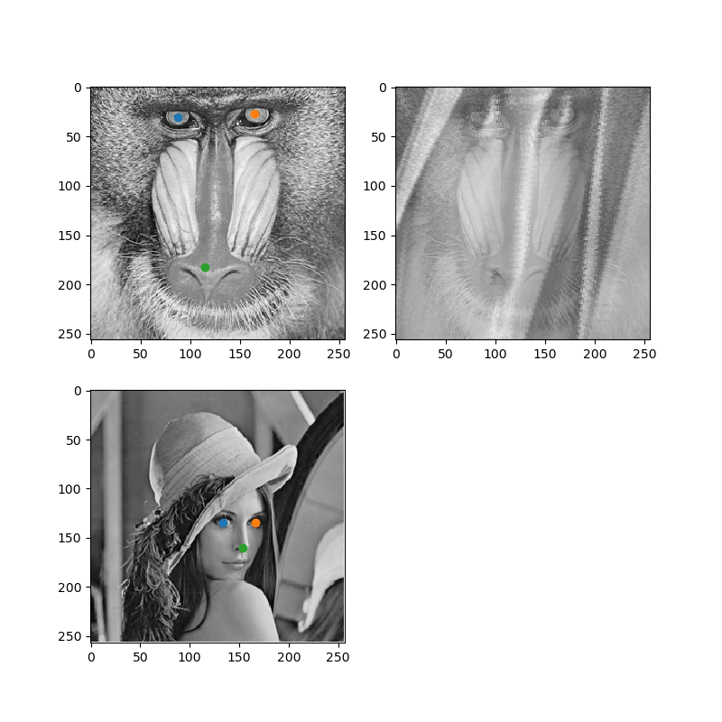

# はじめに
特徴点マッチングにおいてのアフィン行列を求める記事です。この記事では特徴点を手動で決めることとします。

こんな感じで2枚の画像の特徴点をクリックして特徴点を指定して、それに合うように片方の画像をアフィン変換によって変形させて重ねることが目的です。

# 特徴点マッチング
## アフィン行列
画像の各座標を変換させる行列計算

$$
\left(
\begin{array}{c}
x^{'}\\
y^{'}\\
1
\end{array}
\right)
=
\left(
\begin{array}{ccc}
a & b & t_{x}\\
c & d & t_{y}\\
0 & 0 & 1
\end{array}
\right)
\left(
\begin{array}{c}
x\\
y\\
1
\end{array}
\right)
$$
の

$$
A=
\left(
\begin{array}{ccc}
a & b & t_{x}\\
c & d & t_{y}\\
0 & 0 & 1
\end{array}
\right)
$$
の部分がアフィン行列。
この行列だけで画像の回転、拡大、縮小、移動、反転、せん断を表せる優れもの！！

アフィン変換については以下の記事を参考にさせていただきました。
[完全に理解するアフィン変換](https://qiita.com/koshian2/items/c133e2e10c261b8646bf "完全に理解するアフィン変換")
[行列によるアフィン変換（拡大縮小・回転・剪断・移動）　～Python画像処理の再発明家～](https://qiita.com/secang0/items/7531e47305a199f02aae "行列によるアフィン変換（拡大縮小・回転・剪断・移動）　～Python画像処理の再発明家～")

## アフィン行列の算出

2つの画像の特徴点が$N(N\geqq3)$個あったとき、変換前の画像の特徴点の座標を

$$
\left(
\begin{array}{c}
x_{n}\\
y_{n}
\end{array}
\right)
$$
変換後の座標を

$$
\left(
\begin{array}{c}
x^{'}_{n}\\
y^{'}_{n}
\end{array}
\right)
$$
として$N$個の座標すべてにアフィン変換をする行列式は

$$
\left(
\begin{array}{c}
x^{'}_{1}&x^{'}_{2}&\cdots&x^{'}_{N}\\
y^{'}_{1}&x^{'}_{2}&\cdots&x^{'}_{N}\\
1&1&\cdots&1
\end{array}
\right)
=
\left(
\begin{array}{ccc}
a & b & t_{x}\\
c & d & t_{y}\\
0 & 0 & 1
\end{array}
\right)
\left(
\begin{array}{c}
x_{1}&x_{2}&\cdots&x_{N}\\
y_{1}&x_{2}&\cdots&x_{N}\\
1&1&\cdots&1
\end{array}
\right)
$$
で表すことが出来ます。この$a,b,c,d,t_{x},t_{y}$の最もらしい値を求めることが目的となります。
ここで1組の変換前後の座標

$$
\left(
\begin{array}{c}
x_{n}\\
y_{n}
\end{array}
\right)
,
\left(
\begin{array}{c}
x^{'}_{n}\\
y^{'}_{n}
\end{array}
\right)
$$

に対してアフィン変換

$$
\left(
\begin{array}{c}
x^{'}_{n}\\
y^{'}_{n}\\
1
\end{array}
\right)
=
\left(
\begin{array}{ccc}
a & b & t_{x}\\
c & d & t_{y}\\
0 & 0 & 1
\end{array}
\right)
\left(
\begin{array}{c}
x_{n}\\
y_{n}\\
1
\end{array}
\right)
$$

を展開すると

$$
\begin{aligned}
x^{'}_{n}&=ax_{n} + by_{n} + t_{x}\\
y^{'}_{n}&=cx_{n} + dy_{n} + t_{y}
\end{aligned}
$$

になります。

$$
w_1=
\left(
\begin{array}{c}
a\\
b\\
t_{x}
\end{array}
\right)
,
w_2=
\left(
\begin{array}{c}
c\\
d\\
t_{y}
\end{array}
\right)
,
p_{n}=
\left(
\begin{array}{c}
x_{n} & y_{n} & 1
\end{array}
\right)
,
p^{'}_{n}=
\left(
\begin{array}{c}
x^{'}_{n} & y^{'}_{n} & 1
\end{array}
\right)
$$

というようなベクトルを用意すれば

$$
\begin{aligned}
x^{'}_{n}&=p_{n}w_1\\
y^{'}_{n}&=p_{n}w_2
\end{aligned}
$$

と書けます。変換先の座標とアフィン変換による返還後の座標の距離を誤差関数にして、誤差関数が一番小さくなる時の $w_1$ と$w_2$を求めます。
誤差関数$E$を

$$
E=\sum_{n=1}^{N}
\Bigl(
(x^{'}_{n} - p_{n}w_1)^{2} + (y^{'}_{n} - p_{n}w_2)^{2}
\Bigr)
$$

に設定してこれを行列形式で表すために

$$
X^{'}=
\left(
\begin{array}{c}
x^{'}_{1}\\
\vdots\\
x^{'}_{N}
\end{array}
\right)
,
Y^{'}=
\left(
\begin{array}{c}
y^{'}_{1}\\
\vdots\\
y^{'}_{N}
\end{array}
\right)
,
P=
\left(
\begin{array}{c}
p_{1}\\
\vdots\\
p_{N}
\end{array}
\right)
=
\left(
\begin{array}{c}
x_{1} & y_{2} & 1\\
&\vdots&\\
x_{N} & y_{N} & 1
\end{array}
\right)
$$

とすれば

$$
E=
(X^{'} - Pw_1)^{T}(X^{'} - Pw_1) + (Y^{'} - Pw_2)^T(Y^{'} - Pw_2)
$$

と書けます。展開すると

$$
\begin{aligned}
E&=({X^{'}}^{T} - (Pw_1)^{T})(X^{'} - Pw_1) + ({Y^{'}}^{T} - (Pw_2)^{T})(Y^{'}-Pw_2)\\
&={X^{'}}^{T}X^{'} - {X^{'}}^{T}Pw_1 - (Pw_1)^{T}X^{'} + (Pw_1)^{T}(Pw_1) + {Y^{'}}^{T}Y^{'} - {Y^{'}}^{T}Pw_2 - (Pw_2)^{T}Y^{'} + (Pw_2)^{T}(Pw_2)\\
&={X^{'}}^{T}X^{'} - w^{T}_{1}P^{T}{X^{'}}^{T} - w^{T}_{1}P^{T}{X^{'}}^{T} + w^{T}_{1}P^{T}Pw_{1} + {Y^{'}}^{T}Y^{'} - w^{T}_{2}P^{T}{Y^{'}}^{T} - w^{T}_{2}P^{T}{Y^{'}}^{T} + w^{T}_{2}P^{T}Pw_{2}\\
&={X^{'}}^{T}X^{'} - 2w^{T}_{1}P^{T}{X^{'}}^{T} + w^{T}_{1}P^{T}Pw_{1} + {Y^{'}}^{T}Y^{'} - 2w^{T}_{2}P^{T}{Y^{'}}^{T} + w^{T}_{2}P^{T}Pw_{2}\\
\end{aligned}
$$

となります。$w_1$、$w_2$で偏微分して$E$が小さくなる時を求めると

$$
\begin{aligned}
\frac{\partial E}{\partial w_{1}}=-2P^{T}X^{'} + 2P^{T}Pw_{1}&=0\\
2P^{T}w_{1}&=2P^{T}X^{'}\\
w_{1}&=(P^{T}P)^{-1}P^{T}X^{'}\\
\frac{\partial E}{\partial w_{2}}=-2P^{T}Y^{'} + 2P^{T}Pw_{2}&=0\\
2P^{T}w_{2}&=2P^{T}Y^{'}\\
w_{2}&=(P^{T}P)^{-1}P^{T}Y^{'}
\end{aligned}
$$

これにより$w_1$、$w_2$を求められたのでアフィン行列を求められました。

## 実装
Pythonでnumpyだけ使って実装して終わります。

```python
import numpy as np
import math
from PIL import Image
from matplotlib import pyplot as plt


# 参照画像の範囲超えたやつは配列の最後を参照するようにする関数
def clip_xy(ref_xy, img_shape):
    # x座標について置換
    ref_x = np.where((0 <= ref_xy[:, 0]) & (ref_xy[:, 0] < img_shape[1]), ref_xy[:, 0], -1)
    # y座標について置換
    ref_y = np.where((0 <= ref_xy[:, 1]) & (ref_xy[:, 1] < img_shape[0]), ref_xy[:, 1], -1)

    # 結合して返す
    return np.vstack([ref_x, ref_y]).T


# アフィン変換
def affine(data, affine, draw_area_size):
    # data:アフィン変換させる画像データ
    # affine:アフィン行列
    #:draw_area_size:dataのshapeと同じかそれ以上がいいかも

    # アフィン行列の逆行列
    inv_affine = np.linalg.inv(affine)

    x = np.arange(0, draw_area_size[1], 1)
    y = np.arange(0, draw_area_size[0], 1)
    X, Y = np.meshgrid(x, y)

    XY = np.dstack([X, Y, np.ones_like(X)])
    xy = XY.reshape(-1, 3).T

    # 参照座標の計算
    ref_xy = inv_affine @ xy
    ref_xy = ref_xy.T

    # 参照座標の周りの座標
    liner_xy = {}
    liner_xy['downleft'] = ref_xy[:, :2].astype(int)
    liner_xy['upleft'] = liner_xy['downleft'] + [1, 0]
    liner_xy['downright'] = liner_xy['downleft'] + [0, 1]
    liner_xy['upright'] = liner_xy['downleft'] + [1, 1]

    # 線形補間での重み計算
    liner_diff = ref_xy[:, :2] - liner_xy['downleft']

    liner_weight = {}
    liner_weight['downleft'] = (1 - liner_diff[:, 0]) * (1 - liner_diff[:, 1])
    liner_weight['upleft'] = (1 - liner_diff[:, 0]) * liner_diff[:, 1]
    liner_weight['downright'] = liner_diff[:, 0] * (1 - liner_diff[:, 1])
    liner_weight['upright'] = liner_diff[:, 0] * liner_diff[:, 1]

    # 重み掛けて足す
    liner_with_weight = {}
    for direction in liner_weight.keys():
        l_xy = liner_xy[direction]
        l_xy = clip_xy(l_xy, data.shape)
        l_xy = np.dstack([l_xy[:, 0].reshape(draw_area_size), l_xy[:, 1].reshape(draw_area_size)])
        l_weight = liner_weight[direction].reshape(draw_area_size)
        liner_with_weight[direction] = data[l_xy[:, :, 1], l_xy[:, :, 0]] * l_weight

    data_linear = sum(liner_with_weight.values())
    return data_linear


# 特徴点からアフィン行列求める関数
def registration(P, x_dash, y_dash):
    w1 = np.linalg.inv(P.T @ P) @ P.T @ x_dash
    w2 = np.linalg.inv(P.T @ P) @ P.T @ y_dash
    affine_matrix = np.array([[1.0, 0.0, 0.0],
                              [0.0, 1.0, 0.0],
                              [0.0, 0.0, 1.0]])
    affine_matrix[0, :] = w1
    affine_matrix[1, :] = w2
    return affine_matrix


# クリックした特徴点保存する配列
future_points1 = np.array([[1, 1]])
future_points2 = np.array([[1, 1]])
count_fp1 = 0
count_fp2 = 0


# クリックで特徴点決める
def onclick(event):
    global future_points1
    global future_points2
    global count_fp1
    global count_fp2

    click_axes = event.inaxes
    x = math.floor(event.xdata)
    y = math.floor(event.ydata)
    if click_axes == ax1:
        if count_fp1 == 0:
            future_points1[0, :] = (x, y)
            count_fp1 = 1
        else:
            future_points1 = np.vstack([future_points1, np.array([x, y])])
            count_fp1 += count_fp1
        print(future_points1)
    if click_axes == ax2:
        if count_fp2 == 0:
            future_points2[0, :] = (x, y)
            count_fp2 = 1
        else:
            future_points2 = np.vstack([future_points2, np.array([x, y])])
            count_fp2 += count_fp2
        print(future_points2)
    click_axes.scatter(x, y)
    fig.canvas.draw_idle()


# エンターおすと画像重ね合わせ
def onEnter(event):
    if event.key == 'enter' and future_points1.size == future_points2.size and future_points1.size >= 3:
        # P:変換元の座標行列([[x,y,1],[x,y,1],...]
        # x_dash:変換先のx座標ベクトル
        # y_dash:変換先のy座標ベクトル
        vec_one = np.ones((future_points2.shape[0], 1))
        P = np.hstack([future_points2, vec_one])
        x_dash = future_points1[:, 0]
        y_dash = future_points1[:, 1]
        affine_matrix = registration(P, x_dash, y_dash)
        # アフィン変換後の画像求める
        affined_image = affine(image2, affine_matrix, image1.shape)
        x = np.arange(0, affined_image.shape[1], 1)
        y = np.arange(0, affined_image.shape[0], 1)
        X_affined, Y_affined = np.meshgrid(x, y)
        ax3.pcolormesh(X_affined, Y_affined, affined_image, cmap='gray', shading='auto', alpha=0.5)
        fig.canvas.draw_idle()


if __name__ == '__main__':
    # 画像読み込み
    image1_path = 'images/Mandrill.bmp'
    image2_path = 'images/Lenna.bmp'
    image1 = np.array(Image.open(image1_path).convert('L'))
    image2 = np.array(Image.open(image2_path).convert('L'))
    # 画像の最後にbg_colorの色追加
    bg_color = 256
    image2 = np.hstack([image2, bg_color * np.ones((image2.shape[0], 1), int)])
    image2 = np.vstack([image2, bg_color * np.ones((1, image2.shape[1]), int)])

    x_image1 = np.arange(0, image1.shape[1], 1)
    y_image1 = np.arange(0, image1.shape[0], 1)

    X1, Y1 = np.meshgrid(x_image1, y_image1)

    x_image2 = np.arange(0, image2.shape[1], 1)
    y_image2 = np.arange(0, image2.shape[0], 1)

    X2, Y2 = np.meshgrid(x_image2, y_image2)

    fig = plt.figure(figsize=(8, 8))
    ax1 = fig.add_subplot(221)
    mesh1 = ax1.pcolormesh(X1, Y1, image1, shading='auto', cmap='gray')
    ax1.invert_yaxis()
    ax2 = fig.add_subplot(223)
    mesh2 = ax2.pcolormesh(X2, Y2, image2, shading='auto', cmap='gray')
    ax2.invert_yaxis()
    ax3 = fig.add_subplot(222)
    mesh3 = ax3.pcolormesh(X1, Y1, image1, shading='auto', cmap='gray', alpha=0.5)
    ax3.invert_yaxis()

    cid = fig.canvas.mpl_connect('button_press_event', onclick)
    cid = fig.canvas.mpl_connect('key_press_event', onEnter)
    plt.show()
```


