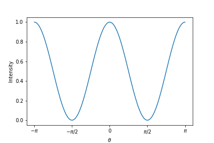

偏光子や波長板による偏光状態の変更はジョーンズ行列$J$によって一般に、
$$
\begin{aligned}
\begin{pmatrix}
E_x^{'} \\
E_y^{'} \\
\end{pmatrix}
=J
\begin{pmatrix}
E_x \\
E_y \\
\end{pmatrix}
\end{aligned}
$$
と表せます。

## 回転行列
最初に回転行列だけ定義しておきます。$x,y$軸上の点を$\theta$回転させるには、回転行列$R$を用いて、
$$
\begin{aligned}
\begin{pmatrix}
x^{'} \\
y^{'} \\
\end{pmatrix}
&=R(\theta)
\begin{pmatrix}
x \\
y \\
\end{pmatrix} \\
&=
\begin{pmatrix}
\cos \theta & -\sin \theta \\
\sin \theta & \cos \theta \\
\end{pmatrix}
\begin{pmatrix}
x \\
y \\
\end{pmatrix}
\end{aligned}
$$
と表せます。よって電場も同じく、

$$
\begin{aligned}
\begin{pmatrix}
E_x^{'} \\
E_y^{'} \\
\end{pmatrix}
=
\begin{pmatrix}
\cos \theta & -\sin \theta \\
\sin \theta & \cos \theta \\
\end{pmatrix}
\begin{pmatrix}
E_x \\
E_y \\
\end{pmatrix}
\end{aligned}
$$

となります。

## 偏光子、検光子
偏光子を通る光は透過軸に沿った直線変更になるため、透過軸が、$x$軸のみ透過させる行列
$$
\begin{aligned}
T=
\begin{pmatrix}
1 & 0 \\
0 & 0 \\
\end{pmatrix}
\end{aligned}
$$
を用いて、
$$
\begin{aligned}
E^{'}&=R(\theta)TR(\theta)^{-1}E \\
\begin{pmatrix}
E_x^{'} \\
E_y^{'} \\
\end{pmatrix}
&=
\begin{pmatrix}
\cos \theta & -\sin \theta \\
\sin \theta & \cos \theta \\
\end{pmatrix}
\begin{pmatrix}
1 & 0 \\
0 & 0 \\
\end{pmatrix}
\begin{pmatrix}
\cos \theta & \sin \theta \\
-\sin \theta & \cos \theta \\
\end{pmatrix}
\begin{pmatrix}
E_x \\
E_y \\
\end{pmatrix} \\
&=
\begin{pmatrix}
\cos^2 \theta & \sin \theta \cos \theta \\
\sin \theta \cos \theta & \sin^2 \theta \\
\end{pmatrix}
\begin{pmatrix}
E_x \\
E_y \\
\end{pmatrix} \\
&=
\begin{pmatrix}
\cos^2 \theta & \dfrac{1}{2} \sin (2\theta) \\
\dfrac{1}{2} \sin (2\theta) & \sin^2 \theta \\
\end{pmatrix}
\begin{pmatrix}
E_x \\
E_y \\
\end{pmatrix}
\end{aligned}
$$
と表すことが出来ます。$R(\theta)^{-1}$は$R(\theta)$の逆回転です。よって$x$軸から右回りに$\theta$回転した偏光子のジョーンズ行列$T_\theta$は
$$
\begin{aligned}
T_\theta=
\begin{pmatrix}
\cos^2 \theta & \dfrac{1}{2} \sin (2\theta) \\
\dfrac{1}{2} \sin (2\theta) & \sin^2 \theta \\
\end{pmatrix}
\end{aligned}
$$
となります。
Pythonで実装してみます。x軸方向に偏向面をもつ電場を用意して、検光子の角度を変えて、通り抜けてきた光の強度をプロットしてみます。

```python
E_in = np.array([1, 0]).reshape([-1,1]) * np.exp(1.0j) # 電場の列ベクトル

theta = np.linspace(-np.pi, np.pi, 100) # 検光子の角度

T_theta = np.array([[np.cos(theta)**2, np.sin(2*theta)/2],
                    [np.sin(2*theta)/2, np.sin(theta)**2]]) # 検光子のジョーンズ行列

E_out = []
for i in range(len(theta)):
    E_out.append(T_theta[:,:,i] @ E_in) # 各角度ごとにジョーンズ行列をE_inに作用

E_out = np.array(E_out)
I = np.abs(E_out[:, 0, 0]) **2 + np.abs(E_out[:, 1, 0])**2 # 電場から光強度へ

# プロット
plt.plot(theta, I)
plt.xticks(np.arange(-np.pi, np.pi+0.1, np.pi/2), [r"$-\pi$", r"$-\pi/2$", "0", r"$\pi/2$", r"$\pi$"])
plt.xlabel("$\\theta$")
plt.ylabel("Intensity")
plt.show()
```



$\theta=0$で最大となり、偏向面と直角になる$\theta=\pi/2$で光強度が0となることがわかります。

## 波長板
$x$軸にfast軸をもつ波長板に置いて、位相を$\delta$だけ進める行列$M$は
$$
\begin{aligned}
M=
\begin{pmatrix}
e^{i\dfrac{\delta}{2}} & 0 \\
0 & e^{-i\dfrac{\delta}{2}} \\
\end{pmatrix}
\end{aligned}
$$
として表せます。この波長板が$x$軸から$\theta$だけ傾いて入れば、波長板を通過する電場は次のように表せます。
$$
\begin{aligned}
E^{'} &= RMR^{-1}E \\
\begin{pmatrix}
E_x^{'} \\
E_y^{'} \\
\end{pmatrix}
&=
\begin{pmatrix}
\cos \theta & -\sin \theta \\
\sin \theta & \cos \theta \\
\end{pmatrix}
\begin{pmatrix}
e^{i\dfrac{\delta}{2}} & 0 \\
0 & e^{-i\dfrac{\delta}{2}} \\
\end{pmatrix}
\begin{pmatrix}
\cos \theta & \sin \theta \\
-\sin \theta & \cos \theta \\
\end{pmatrix}
\begin{pmatrix}
E_x \\
E_y \\
\end{pmatrix} \\
&=
\begin{pmatrix}
e^{i\dfrac{\delta}{2}}\cos^2 \theta + e^{-i\dfrac{\delta}{2}}\sin^2 \theta & i\sin(2\theta) \sin\left( \dfrac{\delta}{2}\right) \\
i\sin(2\theta)\sin\left( \dfrac{\delta}{2}\right) & e^{i\dfrac{\delta}{2}}\sin^2 \theta + e^{-i\dfrac{\delta}{2}}\cos^2 \theta \\
\end{pmatrix}
\begin{pmatrix}
E_x \\
E_y \\
\end{pmatrix}
\end{aligned}
$$
よってfast軸が$x$軸から右回りに$\theta$傾いて、fast軸を$\delta$だけ早める波長板のジョーンズ行列は
$$
M_{\theta, \delta} =
\begin{pmatrix}
e^{i\dfrac{\delta}{2}}\cos^2 \theta + e^{-i\dfrac{\delta}{2}}\sin^2 \theta & i\sin(2\theta) \sin\left( \dfrac{\delta}{2}\right) \\
i\sin(2\theta) \sin\left( \dfrac{\delta}{2}\right) & e^{i\dfrac{\delta}{2}}\sin^2 \theta + e^{-i\dfrac{\delta}{2}}\cos^2 \theta \\
\end{pmatrix}
$$
となります。


参考
[第 3 章 Jones 法による偏光状態の変換の記述](http://www.uesu.phys.waseda.ac.jp/Japanese/lec/chapter3.pdf)