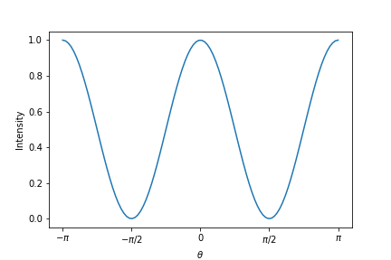

import Main from "../../src/components/three/test"

This is my first blog post! Isn't it *great*?

Some of my **favorite** things are:

* Petting dogs
* Singing
* Eating potato-based foods

$a^2 + b^2 = c^2$



```js
const prism = "test";
```

<Main name="test"/>